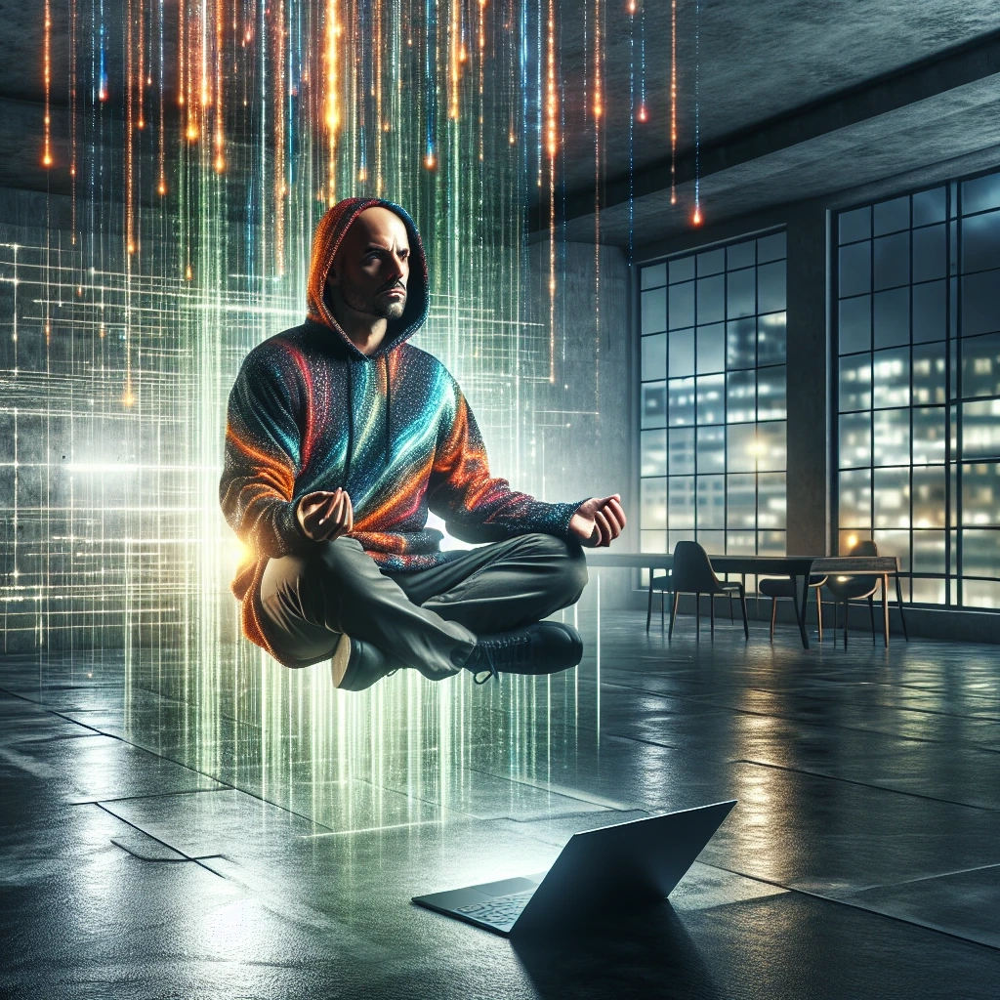

# discord-bot-ol-bootsie
Ol' Bootsie is a highly configurable Discord bot that interfaces with the OpenAI API, written for Node.js in Typescript. I've been on a software development hiatus for several years, and this was a great time and opportunity for me to dust off the cobwebs and get back to my roots.

There are many great new genAI projects being started since the boom ChatGPT created. As soon as the OpenAI API became publicly available, I knew I wanted to build with it. This is my first project using the API, and went from 0 to 1.0 in about 2.5 months.

If you'd like to try out the bot on Discord or chat with me - feel free to [join my server](https://discord.gg/bH6x6Jbv39)!

## Table of contents
* [User features](#user-features)
* [Admin features](#admin-features)
* [Interaction screenshots](#interaction-screenshots)
* [Bot-generated images](#bot-generated-images-using-dall-e-3)
* [Contributing](#contributing)
* [Acknowledgements](#acknowledgements)
* [License](#license)

## Other pages
* [Setup guide](doc/setup-guide.md)
* [Changelog](doc/changelog.md)

## User features
Chat bot interaction types:

  * Direct bot engagements: @-mention bots with a statement, question, or any other GPT-style prompt.
  * Conversation continuity: bots will remember conversation context up to a configured timeframe.
  * Automatic bot engagements: Bots will react to messages, or occassionally engage in conversation.
  * Direct messaging: Users can DM the bot as long as they share a common server.
  * Image prompts: describe an image to generate, and the bot will respond with a chat embed of a DALL-E style generation.

[:arrow_up: Back to top](#discord-bot-ol-bootsie)

## Admin features
Chat bot behavior is highly configurable!

  * Automatic engagements and reactions can be configured using a probability %, and a minimum number of messages to engage based upon.
  * Conversation context can be configured to be maintained by user or channel.
  * Conversation context can be configured to last a certain amount of time (default: 15 minutes).
  * Image generation can be enabled or disabled. When disabled, the bot will respond to image prompts conversationally.
  * Users are allocated tokens for image generation, as it is a more costly API call. The default is 3 tokens for images, which replenish after a default of one hour.
  * OpenAI API parameters can be customized:
    * API key (required)
    * API max retries (default: `5`)
    * Chat Completion max tokens (default: `4096`)
    * Chat Completion model (default: `gpt-4o`)
    * Chat Completion system prompt: define your own bot persona and behavior! ([examples](https://prompts.chat/))
    * Chat Completion temperature: defines variance in bot responses (default: `0.6`)
  * Debug logging (disabled by default)
    * Break-glass debug logging can be enabled after the bot is running by touching a blank `DEBUG` file in the project root directory.

[:arrow_up: Back to top](#discord-bot-ol-bootsie)

## Interaction screenshots

   
  <em>Prompting a bot into a conversation</em>
    

   
  <em>Unprompted bot engagements</em>
    

   
  <em>Direct messages with a bot</em>

[:arrow_up: Back to top](#discord-bot-ol-bootsie)

## Bot-generated images using `dall-e-3`

  
  
  
  

[:arrow_up: Back to top](#discord-bot-ol-bootsie)

## Contributing

Please create an issue for enhancement requests or bug reports, or feel free to fork the project to submit your own contributions! To ensure that your PRs are easier to integrate, please create a feature branch off of the `dev` branch to work from. I will leave feedback on the PR if I believe that any changes need to be made before merging.

### Contributors:
* [divyakelaskar](https://github.com/divyakelaskar)

[:arrow_up: Back to top](#discord-bot-ol-bootsie)

## Acknowledgements

A huge thank you to both OpenAI and Discord.js for creating libraries that are easy to work with. Without these projects, I would not have been able to create my project so quickly.

  
  

[:arrow_up: Back to top](#discord-bot-ol-bootsie)

## License

Distributed under the UNLICENSE license. See `LICENSE` for more information.

[:arrow_up: Back to top](#discord-bot-ol-bootsie)
